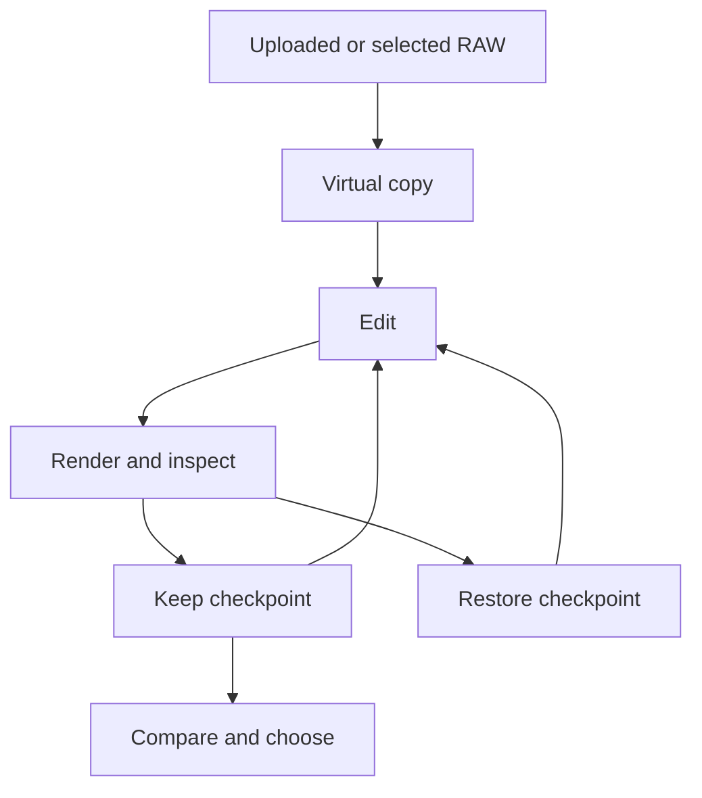

# Raw Photo Agent

**Step-by-step RAW editing in Lightroom Classic, with a checkpoint for every decision.**

[Getting started](#getting-started) · [Local demo](docs/demo.md) · [CLI guide](docs/usage.md) · [Validation](LIVE_VALIDATION.md) · [Contributing](CONTRIBUTING.md)

Raw Photo Agent gives a vision-capable agent a small set of tools to work on a photograph: inspect a preview, make an adjustment, render the result, and keep it or return to an earlier edit. Lightroom develops the original RAW each time. The photographer can compare alternatives and choose the final version.

The current release includes a local browser demo, a TypeScript controller, and a Lightroom Lua plug-in. In the demo, GPT-6 Astra inspects Lightroom JPEG previews through the signed-in Codex CLI and proposes bounded global edits. The controller validates and applies them through Lightroom's SDK. No separate model API key is required for this setup.

## How it works



- **Work on a virtual copy.** Preserve the source photo and its existing edit.
- **Make deliberate changes.** Each candidate records its parent, settings, native snapshot, and intended improvement.
- **Inspect the result.** Export a fresh preview and examine full-resolution detail where needed.
- **Return to an earlier decision.** Restore a Lightroom snapshot and verify the resulting state.
- **Let the photographer choose.** Present two or three alternatives and save the actual selection.

The controller keeps a SQLite journal alongside the previews. Lightroom owns the native edit state; the journal records how each candidate was produced.

## Getting started

You need **Node.js 24+**, **Adobe Lightroom Classic**, and a signed-in **Codex CLI** on the same Mac. Classic 15.5.1 and Codex CLI 0.153.4 have been checked locally. The configured model must be available to your Codex account. The controller and manual CLI can also be used without a model.

```sh
git clone https://github.com/Timverhoogt/raw-photo-agent.git
cd raw-photo-agent
npm ci
node src/cli.ts setup
codex login status
```

1. In Lightroom, open **File → Plug-in Manager → Add** and select the `pluginPath` printed by setup.
2. Close the manager, run **File → Plug-in Extras → Raw Photo Agent: Start / Status**, and dismiss the dialog.
3. Check the bridge and start the local demo. If Codex is not signed in, run `codex login` first.

```sh
node src/cli.ts status
npm run demo
```

Open **[http://127.0.0.1:4318](http://127.0.0.1:4318)**. Upload one RAW/DNG of up to **200 MiB**, or choose the photo already selected in Lightroom. Enter the intended look and start. The demo imports an uploaded file if needed, creates a virtual copy and baseline, and alternates visual decisions with fresh Lightroom renders. You can pause at a checkpoint, finish editing, answer creative questions, and choose among retained versions. The final download is an sRGB JPEG with a maximum long edge of **8192 pixels**, without upscaling.

Keep the native Lightroom window beside the browser to watch the actual editor. The page shows rendered previews and public decision notes; it does not stream Lightroom's screen or simulate cursor movement. **Rendered previews and the editing brief are sent through your signed-in Codex service.** RAW uploads, catalog edits, and the run journal stay on this Mac and are excluded from Git. Keep `.runtime/uploads` while Lightroom references its imported files; these are catalog source files, not disposable cache. See the [demo guide](docs/demo.md) for configuration, privacy, and recovery.

After updating the plugin source, rerun `node src/cli.ts setup`, use **Reload Plug-in** in Plug-in Manager, then close the manager and invoke **Start / Status** again. Dismiss its dialog before checking the heartbeat.

## Manual CLI

Select exactly one RAW/DNG in Lightroom, open Develop, and run `node src/cli.ts selected`. Use the returned photo ID and exact filename:

```sh
node src/cli.ts start \
  --photo 'PHOTO_ID' \
  --filename 'DSC_0123.NEF' \
  --intent 'Natural wildlife; preserve feather detail and surrounding habitat'
```

This creates the working copy, saves a baseline snapshot, and exports a preview. The response contains the run and candidate IDs for subsequent commands.

```sh
node src/cli.ts edit \
  --run 'RUN_ID' \
  --parent 'BASELINE_CANDIDATE_ID' \
  --set '{"Exposure2012":0.25}' \
  --reason 'Lift the subject slightly while retaining highlight texture'
```

Settings are absolute: `0.25` sets exposure to +0.25 EV. Open the returned `previewPath` before deciding what to do next. For restoration, masks, comparisons, and recovery, see the [CLI guide](docs/usage.md).

For a separate agent-driven CLI session, provide the [editing workflow](EDITING_WORKFLOW.md), selected filename, shell access, and a way to inspect exported images. The manual CLI executes commands; the browser demo adds the Codex visual decision loop.

## Current scope

| Area | Available now |
| --- | --- |
| Photo targeting | One uploaded or explicitly selected RAW/DNG; guarded native import and edits restricted to a virtual copy |
| Browser demo | Codex visual decisions, public progress notes, pause/finish, questions, final comparison, and JPEG download |
| Global adjustments | Tone, white balance, presence, color intensity, sharpening, conventional noise reduction |
| Existing masks via manual CLI | Explicit mask selection, local exposure, and local texture; excluded from the autonomous demo |
| History | Native snapshots, candidate ancestry, state checks, persistent operation journal |
| Review | Fresh sRGB JPEGs, detail crops, decoded pixel comparison, recorded A/B/C choices |
| Manual operations | Capture and inspect native edits such as a crop or a UI-created mask |

**Experimental.** A live browser trial completed RAW upload/import, virtual-copy creation, an Astra-proposed global edit, fresh rendering, a second model review, and final JPEG export. Its final selection tested the integration; it was not a new photographer preference. The earlier guided trial also covered crop capture and existing-mask controls. Global snapshot restoration reached an exact pixel match after an additional export; mask snapshots restored recorded settings but retained small pixel differences. General mask rollback and photographic quality across varied images remain unresolved. The [validation record](LIVE_VALIDATION.md) separates these observations from mocked tests.

The autonomous demo currently changes **global numeric settings only**. Automatic cropping, mask creation/local editing in the demo, AI Denoise, independent judges, and an MCP server are future work. A running desktop Lightroom session is required. `RPA_MODEL` overrides the default `gpt-6-astra`; `RPA_MAX_EDITS` sets a budget from 1–10 edits, default 6.

## Development

```sh
npm run check
npm test
```

CI checks TypeScript and the controller/demo tests on Node.js 24 and 26, plus **104 [Lua 5.1 contract checks](plugin/RawPhotoAgent.lrplugin/tests/README.md)**. The 81 TypeScript tests include upload guards, session controls, model decision validation, and recovery. Mock tests do not establish native Lightroom or photographic quality.

```text
src/          Controller, CLI, demo server/agent, SQLite journal, image comparison
demo/         Local browser interface
plugin/       Lightroom Classic plug-in and Lua contract tests
test/         Controller, transport, persistence, and rendering tests
docs/         Demo setup and command reference
```

Generated configuration, photos, run data, previews, and exports stay out of Git. The Lightroom bridge uses local files; the Codex visual decision service receives rendered previews. An uncertain native operation retains the session lock and is never retried automatically. A crashed demo session does not resume itself.

## Further reading

- [CLI guide](docs/usage.md) — setup, commands, masks, and interruption recovery.
- [Editing workflow](EDITING_WORKFLOW.md) — how to assess a photo, iterate, and ask for useful feedback.
- [Architecture and roadmap](DESIGN.md) — the controller boundary and planned interfaces.
- [Lightroom plug-in](plugin/README.md) — protocol, native operations, and restrictions.
- [Live validation](LIVE_VALIDATION.md) — what the first RAW trial established and what it did not.
- [Workflow reference](SIMON_VIDEO_NOTES.md) — notes from Simon d’Entremont’s Lightroom tutorial.
- [Third-party notices](THIRD_PARTY_NOTICES.md) — attribution for bundled code.
- [Local demo guide](docs/demo.md) — upload, visual decisions, controls, configuration, and privacy.
