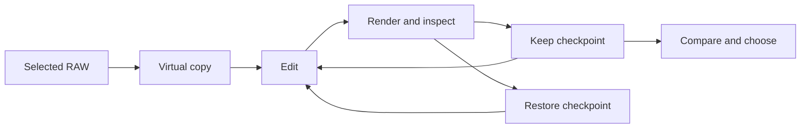

# Raw Photo Agent

**Step-by-step RAW editing in Lightroom Classic, with a checkpoint for every decision.**

[Getting started](#getting-started) · [CLI guide](docs/usage.md) · [Editing workflow](EDITING_WORKFLOW.md) · [Validation](LIVE_VALIDATION.md) · [Contributing](CONTRIBUTING.md)

Raw Photo Agent gives a vision-capable agent a small set of tools to work on a photograph: inspect a preview, make an adjustment, render the result, and keep it or return to an earlier edit. Lightroom develops the original RAW each time. The photographer can compare alternatives and choose the final version.

The current release is a local TypeScript controller and a Lightroom Lua plug-in. A person or an agent session drives the editing loop. No model API key is needed to use the controller.

## How it works



- **Work on a virtual copy.** Preserve the source photo and its existing edit.
- **Make deliberate changes.** Each candidate records its parent, settings, native snapshot, and intended improvement.
- **Inspect the result.** Export a fresh preview and examine full-resolution detail where needed.
- **Return to an earlier decision.** Restore a Lightroom snapshot and verify the resulting state.
- **Let the photographer choose.** Present two or three alternatives and save the actual selection.

The controller keeps a SQLite journal alongside the previews. Lightroom owns the native edit state; the journal records how each candidate was produced.

## Getting started

You need **Node.js 24+** and **Adobe Lightroom Classic** on the same Mac. The native integration has been tested with Classic 15.5.1 on macOS.

```sh
git clone https://github.com/Timverhoogt/raw-photo-agent.git
cd raw-photo-agent
npm ci
node src/cli.ts setup
```

1. In Lightroom, open **File → Plug-in Manager → Add** and select the `pluginPath` printed by setup.
2. Close the manager, run **File → Plug-in Extras → Raw Photo Agent: Start / Status**, and dismiss the dialog.
3. Select exactly one RAW or DNG and open **Develop**.

```sh
node src/cli.ts status
node src/cli.ts selected
```

Use the returned photo ID and exact filename to start a run:

```sh
node src/cli.ts start \
  --photo 'PHOTO_ID' \
  --filename 'DSC_0123.NEF' \
  --intent 'Natural wildlife; preserve feather detail and surrounding habitat'
```

This creates the working copy, saves a baseline snapshot, and exports a preview. The response contains the run and candidate IDs for subsequent commands.

```sh
node src/cli.ts edit \
  --run 'RUN_ID' \
  --parent 'BASELINE_CANDIDATE_ID' \
  --set '{"Exposure2012":0.25}' \
  --reason 'Lift the subject slightly while retaining highlight texture'
```

Settings are absolute: `0.25` sets exposure to +0.25 EV. Open the returned `previewPath` before deciding what to do next. For restoration, masks, comparisons, and recovery, see the [CLI guide](docs/usage.md).

To have an agent conduct the session, give it the [editing workflow](EDITING_WORKFLOW.md), the selected filename, shell access, and a way to inspect exported images. The CLI itself does not make aesthetic judgments.

## Current scope

| Area | Available now |
| --- | --- |
| Photo targeting | One explicitly selected RAW or DNG; edits restricted to a virtual copy |
| Global adjustments | Tone, white balance, presence, color intensity, sharpening, conventional noise reduction |
| Existing masks | Explicit mask selection, local exposure, and local texture |
| History | Native snapshots, candidate ancestry, state checks, persistent operation journal |
| Review | Fresh sRGB JPEGs, detail crops, decoded pixel comparison, recorded A/B/C choices |
| Manual operations | Capture and inspect native edits such as a crop or a UI-created mask |

**Experimental.** One live wildlife-photo trial verified virtual copies, global edits, exports, crop capture, and existing-mask controls. Global snapshot restoration reached an exact pixel match after an additional export. Mask snapshots restored the recorded settings, but strict pixel comparisons retained small differences. General mask rollback reliability remains unresolved. The [validation record](LIVE_VALIDATION.md) separates these observations from simulated tests.

Automatic mask creation, AI Denoise, a standalone comparison interface, an MCP server, and independent judging agents are future work. The running desktop Lightroom session is required.

## Development

```sh
npm run check
npm test
```

CI checks TypeScript and the controller tests on Node.js 24 and 26, plus the [Lua 5.1 contract tests](plugin/RawPhotoAgent.lrplugin/tests/README.md). Mock tests do not establish native Lightroom behavior.

```text
src/          Controller, CLI, SQLite journal, image comparison
plugin/       Lightroom Classic plug-in and Lua contract tests
test/         Controller, transport, persistence, and rendering tests
docs/         Command reference
```

Generated configuration, run data, previews, and photo exports stay out of Git. The controller uses local file communication; any model host you connect has its own image-handling and privacy settings.

## Further reading

- [CLI guide](docs/usage.md) — setup, commands, masks, and interruption recovery.
- [Editing workflow](EDITING_WORKFLOW.md) — how to assess a photo, iterate, and ask for useful feedback.
- [Architecture and roadmap](DESIGN.md) — the controller boundary and planned interfaces.
- [Lightroom plug-in](plugin/README.md) — protocol, native operations, and restrictions.
- [Live validation](LIVE_VALIDATION.md) — what the first RAW trial established and what it did not.
- [Workflow reference](SIMON_VIDEO_NOTES.md) — notes from Simon d’Entremont’s Lightroom tutorial.
- [Third-party notices](THIRD_PARTY_NOTICES.md) — attribution for bundled code.
