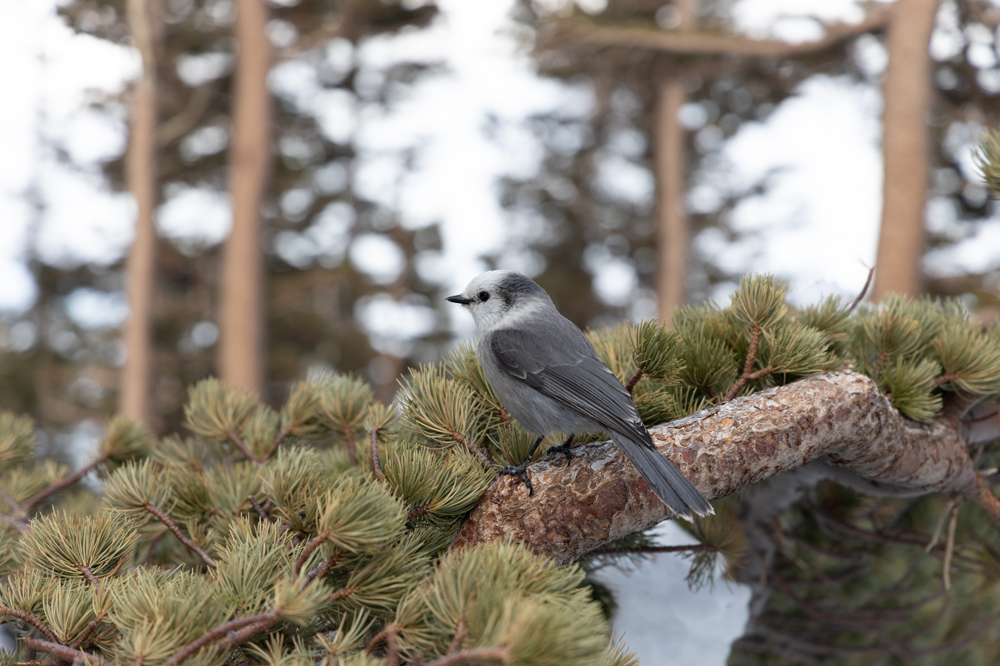
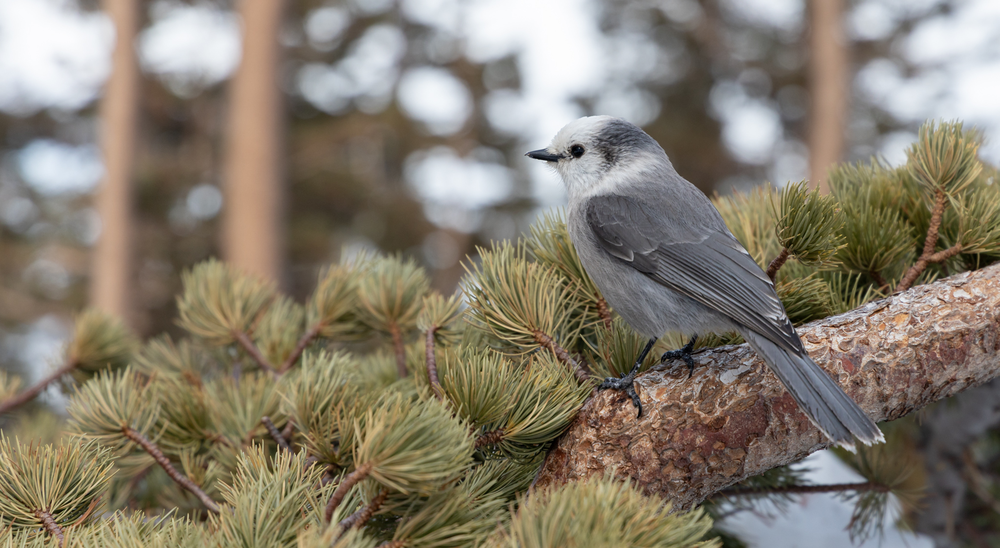

<h1 align="center">Raw Photo Agent</h1>

<p align="center">
  RAW editing guided by the photograph.<br>
  <strong>Assess, adjust, compare, refine — in Lightroom Classic.</strong>
</p>

<p align="center">
  <a href="https://github.com/Timverhoogt/raw-photo-agent/actions/workflows/ci.yml"></a>
  <a href="#getting-started"></a>
  <a href="#current-status"></a>
</p>

<p align="center">
  <a href="#getting-started">Get started</a> ·
  <a href="docs/demo.md">Demo guide</a> ·
  <a href="docs/usage.md">CLI</a> ·
  <a href="DESIGN.md">Architecture &amp; roadmap</a> ·
  <a href="CONTRIBUTING.md">Contribute</a>
</p>

<table>
  <tr>
    <th width="50%">Before</th>
    <th width="50%">After · selected edit</th>
  </tr>
  <tr>
    <td align="center" valign="middle"><a href="docs/images/bird-before.jpg"></a></td>
    <td align="center" valign="middle"><a href="docs/images/bird-after.jpg"></a></td>
  </tr>
</table>

*Guided Lightroom session: tighter framing, restrained tone and color, and a subject-mask lift. Crop and mask creation used Lightroom's interface; the autonomous demo currently makes global adjustments only. [Editing notes →](docs/example.md) · Photo: [Photography Life](https://photographylife.com/).*

Raw Photo Agent aims to bring a photographer's editing process to each image: understand the subject and light, make deliberate adjustments, inspect their effect, and refine the result. The agent chooses the next step from actual previews; Lightroom develops the original RAW. You can pause, give feedback, and choose which version to keep.

## Why this workflow

- **Go beyond the starting treatment.** Presets are useful starting points, and [adaptive presets](https://www.adobe.com/learn/lightroom-cc/web/optimize-workflow-with-adaptive-presets) can target the subject or sky. The additional work here is to inspect the resulting image, account for your brief, and revise earlier decisions as the edit develops.
- **Keep the captured photograph as the source.** The agent controls Lightroom development settings. Lightroom renders the RAW for every candidate, and the settings remain editable on a virtual copy. The supported adjustments do not use an image-generation model to synthesize replacement scene content.
- **Check the tradeoffs.** Opening shadows can reveal a subject and expose noise; extra sharpening can bring out detail and introduce halos. The intended workflow evaluates the visible result against earlier versions, keeps useful changes, and stops when further editing does not help. You choose the final version.

The [editing procedure](EDITING_WORKFLOW.md) follows a photographic sequence: composition and white balance, tonal balance and subject emphasis, color, detail, and final review. Steps can be skipped or revisited. The autonomous demo currently handles the global-adjustment portion; guided sessions can use additional Lightroom tools.

**The goal is a better finished photograph, with native RAW control.** Following this process creates an opportunity for better decisions; it does not establish professional judgment or superior results by itself. That needs blinded comparisons against a well-chosen preset, Lightroom's automatic adjustments, and a direct AI image edit, judged for visual quality, fidelity, time, and cost. See [current validation](LIVE_VALIDATION.md).

## Getting started

You need **macOS, Adobe Lightroom Classic, Node.js 24+, and a signed-in Codex CLI 0.153.4+**. The configured model must be available to your account. No separate model API key is needed.

```sh
git clone https://github.com/Timverhoogt/raw-photo-agent.git
cd raw-photo-agent
npm ci
node src/cli.ts setup
codex login status
```

If needed, sign in with `codex login`. Then connect Lightroom:

1. Open **File → Plug-in Manager → Add** and select the `pluginPath` printed by setup.
2. Close the manager. Run **File → Plug-in Extras → Raw Photo Agent: Start / Status** and dismiss the dialog.
3. Check the connection and start the demo:

```sh
node src/cli.ts status
npm run demo
```

Open **[localhost:4318](http://127.0.0.1:4318)**. Upload a RAW/DNG (up to 200 MiB), or use the photo selected in Lightroom. Describe the intended look and begin. The final JPEG is exported at up to 8192 pixels on its long edge, without upscaling.

**Data:** RAW files, catalog edits, and the editing journal stay on your Mac. Rendered previews, the editing brief, settings, and feedback go through your signed-in Codex service. Keep `.runtime/uploads` while Lightroom references its imported files. [Setup, controls, privacy, and recovery →](docs/demo.md)

## How it works

**RAW → virtual copy → inspect → adjust → render → compare → choose**

The vision model proposes a supported action. The TypeScript controller validates it, the Lua plug-in applies it through Lightroom's SDK, and Lightroom renders the RAW again. Each candidate records its settings and a native snapshot, so the agent can attempt to return to an earlier checkpoint. A state or pixel mismatch stops the session for inspection.

The demo uses GPT-6 Astra through the signed-in Codex CLI by default. The [manual CLI](docs/usage.md) also works without a model. For agent-led sessions outside the browser, use the [editing workflow](EDITING_WORKFLOW.md).

## Current status

**Experimental.** Live trials have exercised RAW import, virtual copies, global edits, previews, comparisons, and JPEG export. Lightroom Classic 15.5.1 and Codex CLI 0.153.4 have been checked locally.

| Available in the browser | Outside the autonomous demo |
| --- | --- |
| Global tone, white balance, color, sharpening, and conventional noise reduction | Automatic cropping, mask creation/local editing, and AI Denoise |
| Progress notes, pause/finish, creative questions, and final selection | Independent judging agents and batch editing |

The manual workflow can capture crops and adjust an existing mask. **Exact mask rollback remains unresolved**, and photographic quality needs broader evaluation. See the [live validation record](LIVE_VALIDATION.md) for measured results and the [roadmap](DESIGN.md) for planned work.

## Documentation & development

| Guide | What it covers |
| --- | --- |
| [Local demo](docs/demo.md) | Setup, controls, configuration, and recovery |
| [CLI reference](docs/usage.md) | Commands, snapshots, masks, and interruption handling |
| [Editing workflow](EDITING_WORKFLOW.md) | Assessing a photo, iterating, and getting useful feedback |
| [Architecture](DESIGN.md) | Controller, Lightroom bridge, and roadmap |
| [Native plug-in](plugin/README.md) | Protocol and supported Lightroom operations |
| [Contributing](CONTRIBUTING.md) | Development and meaningful bug reports |

```sh
npm run check
npm test
npm run check:codex   # needs the Codex CLI on PATH
```

CI checks TypeScript and the controller/demo tests on Node.js 24 and 26, plus the [Lua 5.1 contract tests](plugin/RawPhotoAgent.lrplugin/tests/README.md). Mocked tests do not establish native Lightroom behavior or photographic quality.

First-party code is [MIT licensed](LICENSE). The example photograph has separate [source credit and rights](docs/example.md#photo-source).

[Workflow reference](SIMON_VIDEO_NOTES.md) · [Third-party notices](THIRD_PARTY_NOTICES.md)
